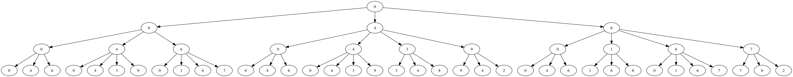

# ChessPhoneNumbers

This is an implementation of the solution to the phone numbers based on chess moves problem.

I made the following assumptions when writing the code, which I hope are correct:

* The number the piece starts off at _is_ included in the telephone number (i.e. would form the first digit)
* A Knight can move over the # or * keys so that 0 to 6 or 0 to 4 is possible.

## Approach
I found the initial scope quite daunting (chess piece, starting point, number of digits) and given there was nothing to 
go on in terms of checking the result(s) were correct in the spec, I decided the best thing to do was to take a step back 
from the overall problem, look at a simple case (single piece, limited number of moves) in order to be able to create some 
test cases.

Given the knight has a peculiar move (one horizontal, two vertical and vice versa) I figured this would have the least 
number of combinations, which I could manually work through. 

Rather than trying to represent the keypad itself in some data structure, I worked out that the only important thing was 
where the piece could go to from its current position e.g. for a knight at number 0, its possible destinations are 0, 4, 6. 
I worked through the positions for each number, so that I had a mapping of current position to all possible next positions. 
This could then give me some test cases:

* Looking at the destinations, its clear that knight starting at 5 is the simplest case as it cannot move anywhere else! 
* Starting at 0 for 1 move, we could have 3 numbers (0, 4, 6)
* Starting at 0 for 2 moves gives us 11 different numbers. 
* For a start of 0 with 3 moves (digits), from the graph, we get 37 three digit numbers. 

This can be seen in the following diagram: 

At this point I decided to then draw the possibilities as a graph to see if there was some pattern/approach I could take. 
It occurred to me that the 11 numbers we get (starting at 0 for 2 moves) is from the total of possible destinations for 
the destinations of the penultimate move.

This then allowed me to write some tests that I could use to assert that the code I would write was generating the correct values.

Knowing a start position, a list of possible destinations, and the moves available when the piece moves to another
number it naturally lent itself to using recursion.

Once things are working for the Knight, the other pieces with a fixed behaviour (rook, bishop, king, queen) could follow 
the same pattern by working out what destinations they could reach from a given number. Again, using a small number of 
iterations allows us to determine what the total should be manually so that we have confidence that the implementation 
is correct.

I left the pawn to last as this was the most complex piece. It essentially has three states - first move, subsequent move(s) 
and then becoming a queen, so we'd need to model the destinations for these, and store the state. I made the assumption that 
even if the pawn started at 1, 2, or 3, it would have to make a move to those numbers (a piece can stay where it is) in order
to become a queen. This may or may not be a correct assumption, but I wanted to clarify my approach.

## Decisions
Some of my thinking when writing this code:

* A factory to create the pieces meant the creation is in one place and not polluting the main app, can also test in isolation
* Factory and use of interface enables the use of polymorphism (and we don't need to change the ChessPhoneNumber class to support a new piece)
* Individual classes for pieces encapsulates their behaviour and we can test them independently.
* The above also means there isn't a 'god' data structure that could be difficult to maintain
* AssertJ used because its interface is fluent.
* ImmutableMap used to ensure the map is fixed once created/not possible to alter it as a side effect

## Building

Please ensure you have `gradle 2.14` installed, as it uses Gradle to resolve dependencies and build the Jar, and Java 8,
as it uses a feature of that version of the language.

Clone this repository to a local folder on your machine.

`./gradlew test` will compile and run unit tests
`./gradlew shadowJar` will build a 'fat' jar containing all the dependencies of the project, placing it in the `build` directory (`ChessPhoneNumbers-all.jar`)

## Running

Once you have built the 'fat' jar, run it as follows:

`java -jar build/libs/ChessPhoneNumbers-all.jar <piece> <start-number>`

e.g.

`java -jar build/libs/ChessPhoneNumbers-all.jar knight 5`

An exception will be thrown if it does not know about the piece requested.

## Improvements/Enhancements

If I had spent more time I would consider:

* increasing the number of unit tests, to cover other pieces and the total generated for other pieces. I quickly did a test for each piece that exercises the factory and ensures that they return some content. Having said that, a test in the main class exercises most of the methods to achive good coverage.
* use a command line argument library like getOpt for extracting command line options more safely.
* optionally print out the numbers generated to allow manual verification of the numbers generated (although with a large number of digits it becomes unmanageable)
* investigate other approaches, I have a feeling it might be possible to solve this without recursion.